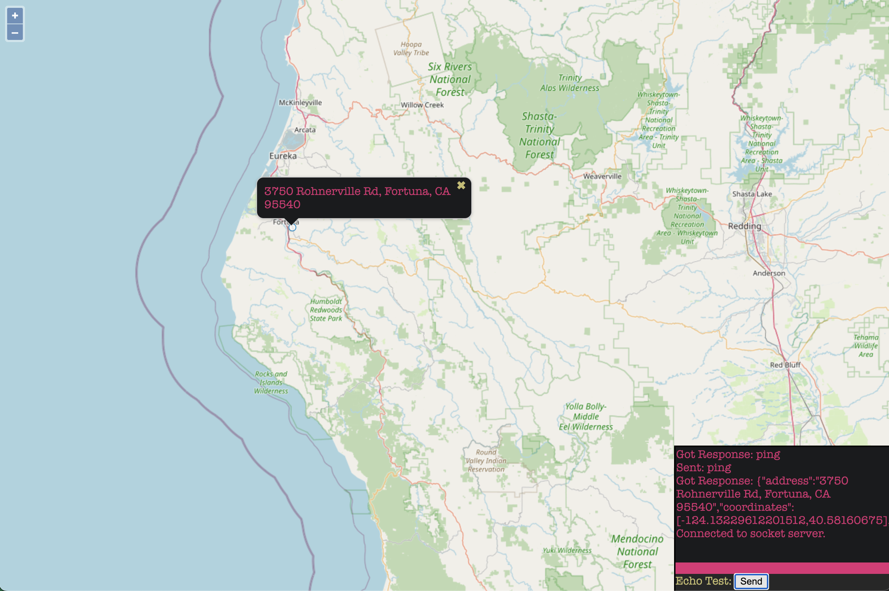

# Mappy
ZMQ address geocode funnel to web-socket Map

# Development Setup

## Server Dependencies
* Latest Tomcat Server, I used 10.0.23
* IntelliJ CE Smart Tomcat Plugin with settings similar to below

## Jar Dependencies
* [gson-2.9.1.jar](https://repo1.maven.org/maven2/com/google/code/gson/gson/2.9.1/gson-2.9.1.jar)
* [ini4j-0.5.4.jar](https://repo.maven.apache.org/maven2/org/ini4j/ini4j/0.5.4/ini4j-0.5.4.jar)
* [jeromq-0.5.2.jar](https://repo.maven.apache.org/maven2/org/zeromq/jeromq/0.5.2/jeromq-0.5.2.jar)
* [jakarta.websocket-api-2.1.0.jar](https://repo.maven.apache.org/maven2/jakarta/websocket/jakarta.websocket-api/2.1.0/jakarta.websocket-api-2.1.0.jar)
* [jakarta.websocket-client-api-2.1.0.jar](https://repo.maven.apache.org/maven2/jakarta/websocket/jakarta.websocket-client-api/2.1.0/jakarta.websocket-client-api-2.1.0.jar)

# Config
* config.ini file with the following config in the project root folder of Mappy:

        [geoapify]
        domain = api.geoapify.com
        apiKey = <get your own api key>
        
        [zmq]
        workAddr   = tcp://127.0.0.1:5557
        resultAddr = tcp://127.0.0.1:5558

* config.ini file in the root of *src/webapp/* with the following conf:

        [zmq]
        resultAddr = tcp://127.0.0.1:5558

* Once all the above is satisfied, you should be able to build using IntelliJ.

# Run
* Start MappyMapper.java which should launch tomcat and the MappyMapper web-socket server
    * Visit [http://127.0.0.1:8080](http://127.0.0.1:8080) to view and test web-socket. 

* Start MappyWorker.java which is the ZMQ/geocode worker

* Start MappyClient.java and enter addresses

## References
[Creating a Websocket Server With the Java API for Websockets](https://developer.vonage.com/blog/18/10/22/create-websocket-server-java-api-dr)
[How to build applications with the WebSocket API for Java EE and Jakarta EE](https://blogs.oracle.com/javamagazine/post/how-to-build-applications-with-the-websocket-api-for-java-ee-and-jakarta-ee)
[18 Java API for WebSocket](https://docs.oracle.com/javaee/7/tutorial/websocket.htm)
[How to Convert Map to JSON to HashMap in Java?](https://www.geeksforgeeks.org/how-to-convert-map-to-json-to-hashmap-in-java/)
[ZMQ Examples w/ JeroMQ](https://github.com/zeromq/jeromq/tree/master/src/test/java/guide)